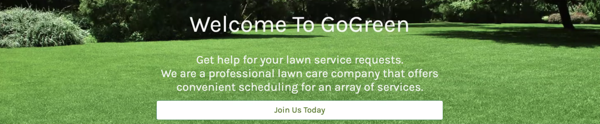
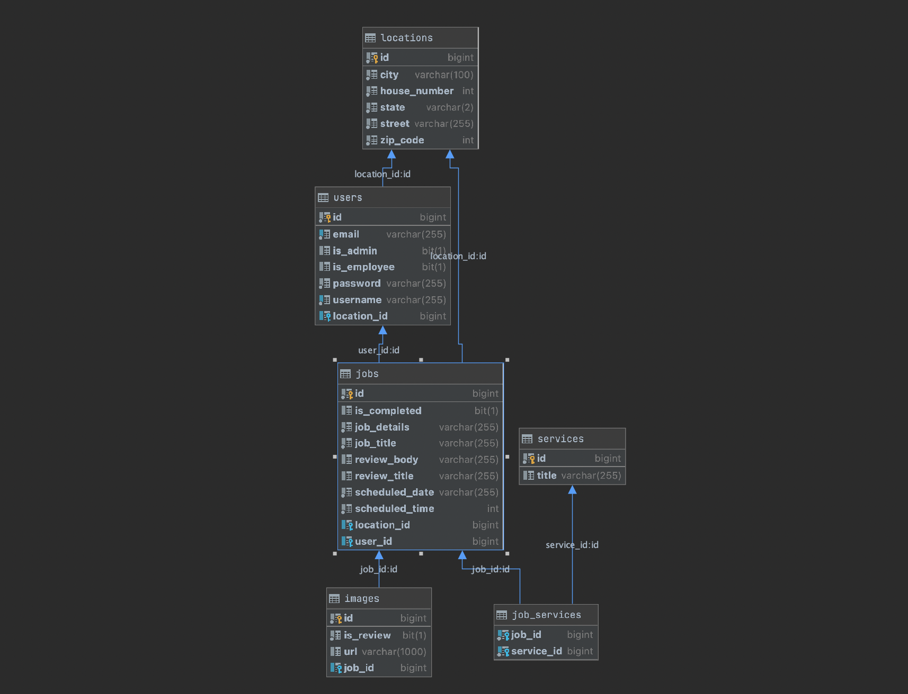

# GoGreen

---

### [Demo](https://gogreen.works/)

---

### Table of Contents
- [Description](#description)
- [Features](#features)
- [Project Planning](#project-planning)
- [Author Information](#authors)

---

## Description
GoGreen is a professional lawn care company that offers convenient scheduling for an array of services.Where customers get help for their lawn service requests.

#### Built With:
* Java
* Spring Boot
* HTML
* CSS
* JavaScript
* jQuery
* Bootstrap
* Mapbox API

### [Back To The Top](#GoGreen)

---

## Features

#### Ability To:
* Display the landing page
* Link the landing page to the register page
* Link the landing page to the login page
* Register users
* Log in users
* Redirect users to their individual user dashboard when logged in
* Ability to users can create a job requests.
* Ability to users can view their job requests.
* Ability to users can edit their job requests.
* Ability to users can delete a job requests.
* Create an individual job review for completed jobs.
* Update a review that created before.
* Delete a review that created before.  
* Allow a job request to have an image.
* Allow a new review to have an image.  
* Integrate password validation when logging in.
* Ensure password is longer than 8 characters are unique
* Ensure usernames are unique
* Ensure email addresses are unique
* Provide user authentication via the Spring Framework
* Lock down the profile page so that it is only available for the logged-in user
* Display a dynamic navbar
    * The Guest Navbar Includes:
        * GoGreen logo
            * Redirects to landing page
        * Home link
        * Services link
        * About Us link
        * Log In link
        * Sign Up link
    * The User Navbar Includes:
        * GoGreen Logo
            * Redirects to landing page
        * Dashboard link
          *New Job Request button
        * Profile Settings link
        * Logout link
* Each Delete button on the app has confirmation for deleting.
* As an admin display a Map created by Mapbox API.
* As an admin check in completed jobs with pins on the map with those user addresses and link to view that job.
* As an admin display all users on Users tab with their userID, username, email and edit button.
* As an admin display all jobs on Jobs tab with their username, Job title, Job status, and actions(View Job, Edit Job, Delete Job). 
* As an admin display all job reviews on Reviews tab with their username, Job title, Review title, Review body and delete action.
* Display a footer.
  *Link to Services page.
  *Link to our github project.
  *Link to About Us page.
  *Email of creators with link of it.

### [Back To The Top](#GoGreen)

---
## Project Planning

### User Stories
* As a visitor, I can navigate to the app domain and see the landing page containing the app pitch and a call to sign up.
* As a visitor, I can register for the app.
* As a visitor, I can view how it works header that explains how to use the app.
* As a visitor, I can see job reviews.
* As a visitor, I can view the Services page
* As a visitor, I can view the About Us page
* As a user, I can login to be redirected to my dashboard page.
* As a user, I can edit my username email and password information.
* As a user, I can Create, View, Update and Delete a job request.
* As a user, I can select a date and time to schedule my service.
* As a user, I can upload an image of the work desired for my job request.
* As a user, I can Create, View, Update and Delete my job review.
* As a user, I can upload an image of the completed work for my job request.
* As an admin, I can view in completed jobs location via Map(MapboxAPI).
* As an admin, I can view all job requests.
* As an admin, I can view all users.
* As an admin, I can view all job reviews.
* As an admin, I can complete/edit/delete all job requests.
* As an admin, I can edit users, job requests, and reviews from the site

### Database Design

### Project Management
For this project, we utilized a Kanban Board to stay organized and manage our daily tasks as developers. We created a list of "todos" and organized them into multiple columns. Because of this, we were easily able to assign ownership and track progress through various phases of development. Our go-to project planning resource was Trello.

Check out our Trello Board [HERE](https://trello.com/b/koducS3y/kanban-board).

### [Back To The Top](#GoGreen)

---

## Authors
[Carlos Padilla](https://github.com/carlospadilla91)

[Colin Warner](https://github.com/colinxwarner)

[Yasin Mogultay](https://github.com/YasinMogultay)

---

### [Back To The Top](#GoGreen)